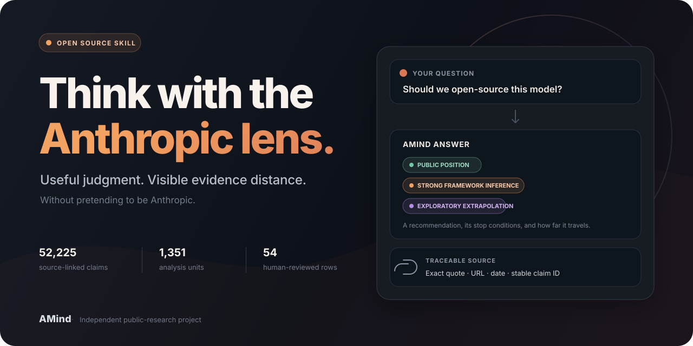

# AMind

## 戴上 Anthropic 的思考帽。

**AMind 是一个有证据链的 Agent Skill：它把 Anthropic 的公开思考方式变成可用于你自己 AI 决策的判断，并让每一步推断都能回到来源。** 它不会冒充 Anthropic。

普通角色提示词会把事实和猜测混在一起。AMind 会把两者之间的距离标出来，同时仍然给你明确建议。

<p align="center">
  <a href="https://github.com/lc708/AMind/stargazers"></a>
  <a href="skills/amind"></a>
  <a href="skills/amind/data/manifest.json"></a>
  <a href="LICENSE"></a>
</p>

<p align="center">
  <a href="README.md">English</a> ·
  <a href="#60-秒开始">安装</a> ·
  <a href="#一个回答是什么样">查看回答</a> ·
  <a href="release/amind-v1/reports/synthesis.zh-CN.md">阅读综合报告</a> ·
  <a href="release/amind-v1/data/representative-evidence-review.jsonl">检查人工复核证据</a>
</p>



## 60 秒开始

把下面一行发给你正在使用的 **Agent**：

```text
$skill-installer install https://github.com/lc708/AMind/tree/main/skills/amind
```

安装完成后，如有需要就重新加载 Agent 或开启新会话，然后拿一个真实问题来试：

```text
用 $amind 压力测试我们的自主智能体上线方案。
请给出明确建议、失败条件和来源。
```

安装就是这些。随 Skill 附带的证据工具只使用 Python 标准库，查询时不联网，也不需要额外 API Key。

> [!TIP]
> 当问题确实需要 Anthropic 视角时，AMind 支持自动调用；第一次体验时直接点名 `$amind` 最稳定。

## 一个回答是什么样

如果你问一个自主智能体是否应该扩大上线范围，AMind 会这样回答：

> **建议**
>
> 分阶段上线。只有在贴近真实任务的评测和独立监控通过后，才扩大自主权限；在主要失败模式仍不可观察时，保留可逆退路。
>
> **[强框架推断 / Strong framework inference]** Anthropic 的公开材料反复把不确定性转化为测量、分阶段承诺和相互独立的防线，而不是盲目加速或无限期停滞。
>
> **[探索性外推 / Exploratory extrapolation]** 对你的项目，这意味着按能力设置晋级闸门，并把终止权限交给上线团队之外的人。
>
> **什么会改变答案**
>
> 如果有强证据证明智能体不能执行不可逆操作，或监控能够稳定发现违规，就可以更快扩大范围。
>
> **来源示例**
>
> *Auditing language models for hidden objectives* · 2025-03-13 · [原始来源](https://www.anthropic.com/research/auditing-hidden-objectives) · `nuwa1-claim-04ed2efdb6c2574083bf375d`

每一项关键结论都会带一个证据距离标签：

| 标签 | 含义 |
|---|---|
| **[公开立场 / Public position]** | 有带引文的公开来源直接支持。 |
| **[强框架推断 / Strong framework inference]** | 来自多份来源反复出现的机制。 |
| **[探索性外推 / Exploratory extrapolation]** | 把公开原则用于没有完全相同先例的新情况。 |

它的工作原则很简单：**建议可以大胆，来源必须透明。**

## 一个 Skill，六种用法

```text
思考：如果用 Anthropic 的思路，我们应该怎样理解自主智能体上线问题？
建议：这个模型要不要开源？请给建议、条件和停止线。
审查：压力测试这份 AI 安全政策，它漏掉了什么？
解释：Anthropic 的公开材料如何看待 scaling 的不确定性？
比较：比较 Anthropic 机构口径、Dario Amodei 和 Jack Clark 的治理思路。
溯源：这项结论来自哪里？请给逐字引句、链接和 claim ID。
```

即使公开材料里没有完全相同的先例，AMind 也会给出建议，只是会诚实标记它走出了直接证据多远。

## 为什么不直接用角色提示词

| | 角色提示词 | 通用搜索 / RAG | AMind |
|---|---|---|---|
| 给出明确建议 | 可以 | 取决于你的实现 | **可以** |
| 区分公开事实与推断 | 很少 | 需要自己构建 | **内置** |
| 区分机构、个人与版本 | 不会 | 需要自己构建 | **内置** |
| 保留张力与反向证据 | 很少 | 需要自己构建 | **内置** |
| 回链逐字引句和稳定 ID | 不会 | 可以实现 | **内置** |
| 使用有界、可检查的语料 | 不会 | 取决于实现 | **会** |
| 最适合实时新事实 | 不适合 | **接入实时来源后适合** | 不适合——AMind v1 是冻结版本 |

AMind 有意保持边界：它不要一个看似新鲜却无法溯源的人格表演，而要一套你能检查、质疑和复算的证据。

## 按你的目标选择入口

| 你想做什么 | 从这里开始 |
|---|---|
| 分析一个真实决策 | [安装 Skill](#60-秒开始) |
| 理解重建出的思考框架 | [阅读综合报告](release/amind-v1/reports/synthesis.zh-CN.md) |
| 做轻量 RAG 或评测 | [使用 54 条人工复核 Gold 证据](release/amind-v1/data/representative-evidence-review.jsonl) |
| 检索完整语料 | [使用 Skill 的本地索引](#检查带索引的-skill) |
| 审计构建方法和边界 | [阅读评测报告](release/amind-v1/reports/evaluation.zh-CN.md)和[发布审计](release/amind-v1/release-audit.json) |

## 它怎样工作

AMind 用一套内部提炼方法把公开材料变成可用判断：

```text
有界公开语料
  → 来源绑定的原子主张
  → 声部与版本边界
  → 反复出现的机制、反向证据与张力
  → 面向新情况的压力测试与建议
```

这套方法会把机构立场与个人声音分开，保留明确修订和反向证据，也不会把研究问题包装成已经确定的答案。

内部方法叫 **Nuwa / 女娲**；公开产品名始终是 **AMind**。

## 可检查的证据与明确的边界

安装后的 Skill 已包含完整本地搜索索引；54 条证据仍是逐条人工复核的 Gold 层，冻结发布包则是原始审计与研究层。

| 数据层 | 数量 |
|---|---:|
| 权威候选 | 1,804 |
| 去重分析单位 | 1,351（1,348 个有正文，3 个有边界的 unavailable 例外） |
| 来源绑定证据段 | 13,436 |
| 带逐字引句、来源身份且可本地检索的原子主张 | 52,225 |
| 人工复核的代表证据 | 54 |
| 反复出现的主题 | 9 |
| 有边界的声部画像 | 5 |
| 保留的核心张力 | 5 |

这里对“人工复核”的表述是刻意收紧的：54 条 Gold 证据全部在完整段落语境中逐条复核；其余索引主张经过结构化、来源绑定和归属审计，但没有声称全部由人逐条复核。Skill 同时携带全部 13,436 个段落，供使用前检查上下文。

### 检查带索引的 Skill

```bash
python3 -B skills/amind/scripts/query.py summary
python3 -B skills/amind/scripts/query.py search "alignment faking" --limit 5
python3 -B skills/amind/scripts/query.py search "latest responsible scaling policy" --current --limit 5
python3 -B skills/amind/scripts/query.py kernel-search "alignment faking" --limit 5
python3 -B skills/amind/scripts/query.py stats
python3 -B skills/amind/scripts/query.py tensions
python3 -B skills/amind/scripts/verify.py
```

默认查询覆盖全部 52,225 条主张，并折叠已审计等价项、排除来源仅仅转述的观点、分散文章/作者/域名占比。引用机器检查结果前，可用 `show <claim-id> --passage` 检查完整绑定段落。

### 审计原始发布包

```bash
git clone https://github.com/lc708/AMind.git
cd AMind

python3 -B release/amind-v1/amind.py summary
python3 -B release/amind-v1/amind.py search "model welfare" --limit 5
python3 -B release/amind-v1/amind.py show nuwa1-claim-f169332e5fa3d349672a254d
```

小型高可信评测优先读取 [`representative-evidence-review.jsonl`](release/amind-v1/data/representative-evidence-review.jsonl)；自定义全量检索则流式读取 [`atomic-claims.jsonl.gz`](release/amind-v1/data/atomic-claims.jsonl.gz)，并连接 [`analysis-units.jsonl.gz`](release/amind-v1/data/analysis-units.jsonl.gz)。

## 跨 Agent 使用

[`skills/amind`](skills/amind) 是一个自包含的 Agent Skill。有能力的 Agent 可以按照自己的约定完成安装；支持 Agent Skills 文件夹格式的客户端，也可以把该目录复制或安装到对应的 skills 目录，然后调用 `amind`。不同客户端的目录和调用语法不同；证据工具本身只需要 Python 3。

## 验证或开发

```bash
python3 -B scripts/build_amind_skill.py --check
python3 -B scripts/test_amind_skill.py
python3 -B scripts/verify_amind_v1_release.py
```

完整 SQLite 索引、绑定段落和 Gold 证据内核都由冻结的 AMind v1 确定性生成，每个数据文件都有 SHA-256 和行数清单。

## 边界

- AMind 重建的是公开思考方式，没有 Anthropic 内部信息；
- 它不以 Anthropic 第一人称说话，也不虚构未公开决定；
- AMind v1 是冻结的研究发布，不是 Anthropic 当前政策的实时来源；
- 语料频次不等于组织共识或个人影响力；
- 机构口径不自动等于个人观点，个人文章也不自动等于机构政策；
- 只有 54 条 Gold 证据经过逐条人工复核；全量索引结果在关键使用前仍需检查绑定段落；
- AMind 是独立公开研究项目，与 Anthropic 没有隶属或背书关系。

<details>
<summary><strong>常见问题</strong></summary>

### AMind 是 Anthropic 官方软件吗？

不是。它是一个完全基于公开材料的独立开源项目。

### AMind 是一个模型吗？

不是。它由 Agent Skill、完整本地证据索引、Gold 证据内核、检索规范和可审计研究发布组成，需要在有能力的宿主模型中使用。

### Skill 里是不是只有 54 条证据？

不是。Skill 可在本地检索全部 52,225 条原子主张，并携带全部 13,436 个绑定段落。54 条只是经过人工逐条复核、用于校准与评测的 Gold 层。

### 为什么 Jack Clark 经常出现？

冻结语料收录了 480 期 Import AI，而部分长篇技术论文又会被拆成数百条主张。Jack Clark 声部共有 10,835 条，并不是两万多条；其中 3,302 条是他转述或引用的他人观点。默认检索会排除这些转述，并限制同一文章、声部和域名的结果数量。详见[检索规范](skills/amind/references/retrieval.md#distribution-audit)。

### 它会声称还原 Anthropic 的内部思考吗？

不会。它只重建公开证据中反复出现的模式，并标记每一步超出直接证据的距离。

### 不安装 Skill，也能使用数据吗？

可以。带索引的 Skill 与原始发布工具都可独立运行，只依赖 Python 标准库，也能直接接入研究或 RAG 工作流。

</details>

## 参与、引用或报告问题

- 发现来源、归属或版本问题？提交一条[证据修正](https://github.com/lc708/AMind/issues/new?template=evidence_correction.yml)。
- 有值得加入的真实问题或集成想法？阅读 [CONTRIBUTING.md](CONTRIBUTING.md)，再提交[功能建议](https://github.com/lc708/AMind/issues/new?template=feature_request.yml)。
- 在研究中使用 AMind？引用信息见 [`CITATION.cff`](CITATION.cff)。
- 发现安全问题？请按 [`SECURITY.md`](SECURITY.md) 私下报告，不要公开开 Issue。

## 许可证

AMind 的软件、原创文档、构建逻辑和 Skill 指令采用 [Apache License 2.0](LICENSE)。公开来源引句与第三方事实元数据的权利仍属于各自作者和出版方，不因本仓库而被重新授权；证据与商标边界见 [NOTICE](NOTICE)。

如果 AMind 让你的判断多了一层真正有用的视角，欢迎 **[Star 这个仓库](https://github.com/lc708/AMind)**，并分享那个“因为看清证据距离而改变答案”的问题。
